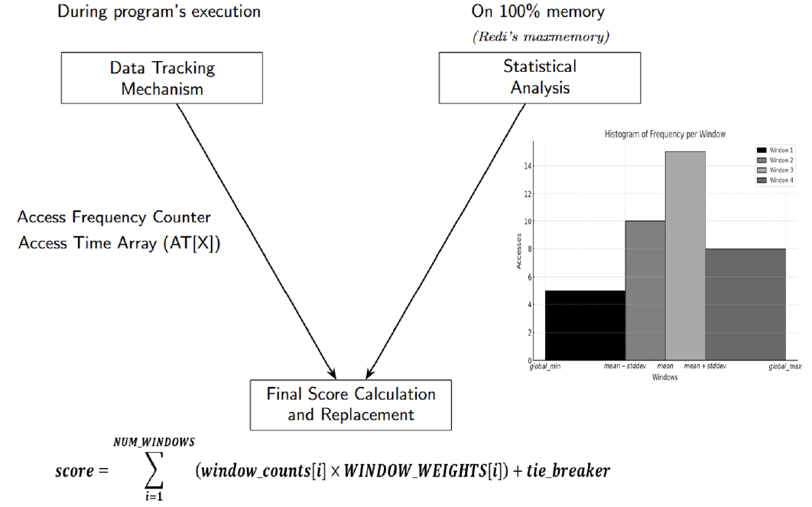
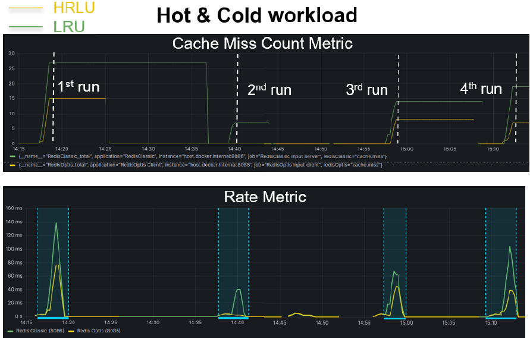

# RedOpt

### Histogram-based LRU eviction policy for Redis

RedOpt is a systems project that extends **Redis** with a new cache eviction policy called **Histogram-based LRU (HLRU)**.

HLRU improves eviction decisions by combining **temporal locality (recency)**, **access frequency**, and the **distribution of accesses over time**.  
The policy is implemented directly inside the Redis source code and evaluated through controlled workload experiments.

This repository contains the Redis modifications, the experimental infrastructure, and the monitoring setup used to evaluate the policy.

---

## Motivation

Memory caches such as Redis are critical for high-performance systems but operate under **limited memory capacity**. When the cache becomes full, an eviction policy decides which keys should be removed.

Redis commonly uses **approximated LRU**, which prioritizes recently accessed keys. While effective in many cases, LRU struggles with several realistic workloads:

- Mixed recency/frequency patterns
- Bursty or periodic access patterns
- Scan workloads that pollute the cache
- Hot–cold data distributions

These scenarios require eviction strategies that evaluate **data usefulness more intelligently than pure recency**.

RedOpt explores whether combining recency with **access frequency and statistical analysis of access patterns** can improve cache efficiency.

---

## Technical Highlights

- Implemented a new cache eviction policy (**HLRU**) directly inside the Redis source code.
- Extended Redis object metadata to track:
  - an **8-bit access frequency counter**
  - a **configurable circular buffer of recent access timestamps**
- Implemented a **histogram-based scoring algorithm** combining recency and frequency.
- Integrated the policy into the **Redis eviction pipeline and candidate sampling logic**.
- Built an experimental environment to compare **Redis LRU vs HLRU** across multiple workload patterns.

---

## HLRU Overview

HLRU evaluates eviction candidates using both **how recently** and **how frequently** keys were accessed.

Each candidate key maintains:

- **Frequency counter**  
  Tracks how many times the key has been accessed.

- **Access timestamp array (AT[X])**  
  Stores the last **X access timestamps** using a circular buffer.

During eviction, HLRU:

1. Samples candidate keys (similar to Redis approximated LRU)
2. Computes the **age** of recorded accesses
3. Calculates statistical metrics across candidates:
   - mean
   - standard deviation
   - minimum
   - maximum
4. Creates **dynamic time windows**
5. Builds a histogram of accesses across those windows
6. Computes a weighted eviction score
7. Evicts the candidate with the **lowest usefulness score**

This approach allows Redis to consider **temporal distribution of accesses**, not just the most recent access.

---

## System Architecture

The evaluation environment simulates realistic cache workloads.

JMeter

│

▼

Spring Boot Client

│

▼

Redis (HLRU / Classic)

│

▼

Prometheus + Redis Exporter

│

▼

Grafana Dashboards

Components used in the evaluation:

- Redis **7.2.x**
- Redis source code modifications in **C**
- **Java 11 / Spring Boot** workload client
- **PostgreSQL**
- **JMeter** workload generation
- **Prometheus + Redis Exporter**
- **Grafana** performance visualization
- **Docker** orchestration

This setup enabled controlled comparison between **classic Redis LRU** and **HLRU**.

---

## Workload Scenarios

The evaluation compares eviction policies under several access patterns designed to emulate real caching environments.

Workloads tested:

- **Random / Sequential access**
- **Recency-driven workloads**
- **Hot & Cold distributions**
- **Scanning workloads**

These scenarios represent common patterns found in:

- content delivery networks
- distributed systems
- edge computing
- microservice architectures

---

## Results

HLRU improves cache efficiency in workloads where both recency and frequency influence data usefulness.

### Key findings

| Workload | Result |
|--------|--------|
| Hot & Cold | up to **52.3% fewer cache misses** vs Redis LRU |
| Scanning | up to **45.1% fewer cache misses** |
| Random / Sequential | similar performance to LRU |
| Recency-driven | LRU slightly better |

These results show that **no eviction policy is universally optimal**, but HLRU significantly improves performance in several realistic scenarios.

---

## Memory Trade-off

HLRU introduces a small memory overhead due to the access timestamp array.

The parameter **AT[X]** controls the number of stored access timestamps.

Increasing this value:

- improves eviction decision quality
- increases memory usage per key

Experiments evaluate multiple values of **X** to balance performance and memory consumption.

---

## Repository Structure

RedOpt

│

├── redis-source-code-modifications/

│ Redis modifications implementing HLRU

│

├── client/

│ Spring Boot workload client

│

├── server/

│ Redis server configured with HLRU

│

├── server-classic/

│ Baseline Redis configuration

│

├── prometheus/

│ Monitoring configuration

│

├── docker-compose.yml

│ Infrastructure for running experiments

---

## Engineering Takeaway

HLRU demonstrates that eviction policies combining **recency, frequency, and statistical analysis of access patterns** can outperform classic LRU in several realistic caching scenarios.

However, eviction strategies remain **workload-dependent**, and selecting the optimal policy requires understanding the characteristics of the application workload.

---

## Thesis Context

This repository was developed as part of the MSc thesis:

**Evaluation and Development of New Cache Replacement Policies: The Histogram-based LRU Policy**

Department of Informatics  
Athens University of Economics and Business

---

## Future Work

Potential extensions include:

- evaluation on larger distributed deployments
- adaptive tuning of access history depth (`AT[X]`)
- automatic detection of workload patterns
- dynamic switching between eviction strategies

---

## Author

**Eleni Driva**
